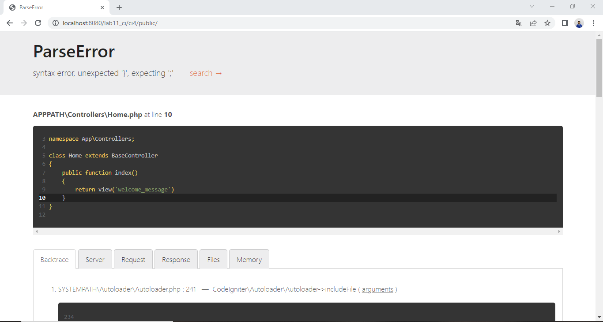

Nama : Rahmat

NIM : 312010229

Kelas : TI.20.A.2

# Lab11Web

## Code Igniter

### Konfigurasi web server

Sebelum memulai menggunakan Framework Codeigniter, perlu dilakukan konfigurasi
pada webserver. Beberapa ekstensi PHP perlu diaktifkan untuk kebutuhan
pengembangan Codeigniter 4.
Untuk mengaktifkan ekstentsi, melalu XAMPP Control Panel, pada bagian
Apache klik Config kemudian klik PHP.ini dan pada bagian extention hilangkan tanda titik koma (;) kemudian simpan dan restart kembali apachenya.

### Instalasi Codeigniter 4

Untuk instalasi CI 4 ada cara manual dan dengan menggunakan composer, untuk praktikum kali ini menggunakan cara manual.

Ini langkah-langkahnya :

1. Unduh Codeigniter dari website https://codeigniter.com/download
2. Extrak file zip Codeigniter ke direktori htdocs/lab11_ci.
3. Ubah nama direktory framework-4.x.xx menjadi ci4.
4. Buka browser dengan alamat http://localhost/lab11_ci/ci4/public/

Seperti ini tampilannya di browser.

### Menjalankan CLI (Command Line Interface)

Untuk mengakses CLI buka terminal/command prompt. Arahkan lokasi direktori sesuai dengan direktori kerja project dibuat
(xampp/htdocs/lab11_ci/ci4/) dengan menggunakan (cd c:\xampp\htdocs\lab11_ci\ci4) seperti gambar dibawah.

Untuk memudahkan mengetahui jenis errornya, maka perlu diaktifkan mode debugging dengan mengubah nilai konfigurasi
pada environment variable CI_ENVIRINMENT menjadi development dan Ubah nama file env menjadi .env.

Untuk mencoba error tersebut, ubah kode pada file app/Controller/Home.php hilangkan titik koma pada akhir kode. Contoh error yang terjadi seperti gambar dibawah.

### Routing dan Controller

Router terletak pada file app/config/Routes.php

**Membuat Route Baru**

Tambahkan kode berikut.

Untuk mengetahui route yang ditambahkan sudah benar, buka CLI dan jalankan perintah **_php spark routes_**

Coba akses route yang telah dibuat dengan mengakses alamat url http://localhost:8080/about Ketika di akses maka akan muncul tampilan error 404 not found, karena file tersebut belum ada isinya.

Langkah selanjutnya yaitu membuat controller page

**Membuat Controller**

Buat file baru dengan nama page.php

Ini kodenya

Selanjutnya refresh Kembali browser, maka akan ditampilkan hasilnya yaotu halaman
sudah dapat diakses

### Auto Routing

Tambahkan method baru pada Controller Page seperti berikut.

Method ini belum ada pada routing, sehingga cara mengaksesnya dengan menggunakan
alamat: http://localhost:8080/page/tos

### Membuat View

Buat file baru dengan nama about.php pada direktori view (app/view/about.php) kemudian isi
kodenya seperti berikut.

Ubah method about pada class Controller Page menjadi seperti berikut:

Ini tampilannya di browser

### Membuat Layout Web dengan CSS

Buat file css pada direktori public dengan nama style.css(filenya di ambil dari tugas sebelumnya)

Kemudian buat folder template pada direktori view kemudian buat file header.php dan
footer.php

Ini file header.php

Ini file footer.php

Kemudian ubah fileabout.php seperti berikut.

Lalu refresh tampilan pada alamat http://localhost:8080/about

Ini tampilan ketika di klik pada navigasi Artikel.

Ini tampilan ketika di klik pada navigasi About.

Ini tampilan ketika di klik pada navigasi Kontak.

